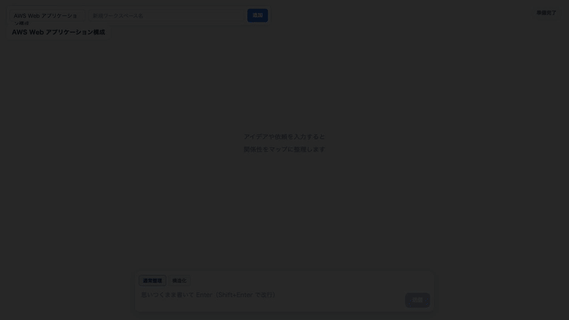

# Maplogue

[Maplogue のサービス概要](docs/product-overview.md)

雑多なテキストを継ぎ足し入力すると、AI がキャンバス上の図（カード・注意書き・リスト・テーブル・グループ）として自動で整理・育成する構造ミラーツールです。プロンプト不要で書くだけ、既存ノードは動かさず差分だけが増える設計です。

## 操作デモ



高画質版は、[MP4 を開く](marketing-video/out/maplogue-prompt-to-map.mp4) からご覧ください。

## アーキテクチャ

```
ブラウザ (Vite + React + React Flow)
  │ POST /api/input ────────────► data/inbox.jsonl に追記
  │ GET  /api/scene (1.5秒ポーリング) ◄─ scene.json + pins.json + 未処理件数を合成
  │ POST /api/pin ─────────────► data/pins.json 更新
  ▼
Vite dev サーバー + カスタムプラグイン（1プロセス）
  ▲ ファイル経由
  ▼
監視役 Claude Code セッション（skills/scene-watch-start.md に従う）
  inbox.jsonl の未処理検知 → scene.json を Edit で最小差分編集
  → history.json に処理済み記録（ローカル runtime data。Git には含めない）
```

**書き手の分離**:

| ファイル | 書き手 | 内容 |
|----------|--------|------|
| `data/scene.json` | 監視セッション | 論理構造のみ（座標なし） |
| `data/pins.json` | サーバー | ドラッグ位置 `{[itemId]: {x,y,parentId}}`（`parentId` でトップレベル絶対 / group 子相対を区別） |
| `data/inbox.jsonl` | サーバー（追記） | ユーザー入力 |
| `data/history.json` | 監視セッション | 処理済み ID とバッチ履歴 |

## セットアップ

```bash
npm install
npm run dev
```

ブラウザで http://127.0.0.1:5173 を開く。

## スマホから見る

既存のローカル用 `5173` を止めずに、スマホ用サーバーを別ポートで起動できる。

```bash
npm run dev:mobile
```

Tailscale を使う場合は、スマホ側の Tailscale を有効にして、表示された `Network` URL のうち `100.x.x.x:5174` を `http://` 付きで開く。

この起動方法では `REALTIME_DRAW_ALLOW_REMOTE_WRITE=1` を付けているため、Tailscale / private IP 経由でも入力送信・ワークスペース追加・ピン保存ができる。通常の `npm run dev` は従来どおりローカルからの書き込みだけを許可する。

## ワークスペースと履歴

画面上部のセレクトでワークスペースを切り替えられる。既存の `data/` 直下の4ファイルは `default` ワークスペースとして扱う。追加したワークスペースは `data/workspaces/<workspaceId>/` に `scene.json` / `inbox.jsonl` / `history.json` / `pins.json` を持つ。

右側の履歴パネルには、現在のワークスペースの `history.json` に記録された処理バッチが新しい順で表示される。

## 監視デーモンの起動（Claude Code）

監視には [Claude Code](https://docs.anthropic.com/en/docs/claude-code) の CLI と、事前のログインが必要です。ログイン済みの `claude` コマンドが使える状態で、別のターミナルから次を実行します。

```bash
npm run watch:scene
```

このコマンドはターミナル上で監視を継続します。停止するには `Ctrl+C` を押してください。`default` と `data/workspaces.json` に登録された全ワークスペースを2秒ごとに再発見し、未処理入力がある巡回だけ `claude -p --dangerously-skip-permissions` でバックグラウンドの単発バッチを起動します。待機中に Claude Code のプロセスは起動しません。

`--dangerously-skip-permissions` はバックグラウンドで編集を完了させるために必要な非対話フラグです。信頼できるローカルリポジトリでのみ使い、監視ワーカーに渡す入力は通常どおりアプリ経由に限定してください。

同時起動は防止され、監視ログは `data/scene-watch-daemon.log` に出力されます。別のターミナルで確認するには次を使えます。

```bash
tail -f data/scene-watch-daemon.log
```

Claude Code を手動で使う場合は、`skills/scene-watch-start.md` の手順に従えます。

## ローカルデータ

`data/scene.sample.json` は公開用のサンプルです。それ以外の `data/` 配下（scene、inbox、history、pins、workspaces、locks、logs）は利用者のローカル runtime data として Git 管理しません。新しい clone では `npm run dev` が初回起動時に空の default ワークスペースを作成します。

## デモ（サンプル図の表示）

```bash
cp data/scene.sample.json data/scene.json
npm run dev
```

card / note（warning）/ list / table / group（子2つ）/ edge が含まれたサンプルが描画される。

## 検証コマンド

`npm install` 後、追加ランタイム（Bun 等）なしで実行できる。

```bash
npm run typecheck          # TypeScript 型チェック
npm test                   # vitest ユニットテスト
npm run validate:scene     # data/scene.json のスキーマ検証（ローカル tsx）
npm run validate:scene data/scene.sample.json
```

## 制約・注意

- **ローカル専用**: dev サーバーは `127.0.0.1` のみ。認証・デプロイは MVP スコープ外。
- **リロード時の再整列**: ノードの自動配置はクライアント側で毎回計算する。`pins.json` に無いノードはリロードで再整列される（仕様）。
- **高さは概算**: 列詰めマソンリーの高さ推定は概算のため、実レンダリングと多少ズレることがある。
- **本番化時**: ファイル inbox + 監視セッションは DB / queue に置き換える想定。
